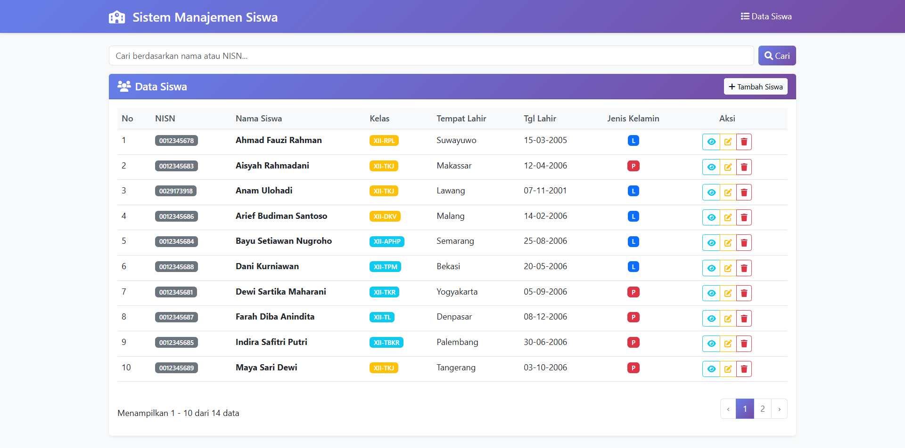

# 🎓 Student Management System

The **Student Management System** is a web-based Laravel application designed to manage student data efficiently and systematically.  
This app allows users to easily search, view, add, edit, and delete student records through an intuitive and responsive interface.

---

## 📸 Project Preview



---

## 🚀 Key Features
- 🔍 **Search Students** by name or NISN  
- ➕ **Add New Student** via form input  
- ✏️ **Edit Student Data**  
- 👁️ **View Student Details**  
- 🗑️ **Delete Student**  
- 📊 **Pagination** for easier navigation  
- 💻 **Modern & Responsive UI** built with Bootstrap  

---

## 🧩 Tech Stack
- **Laravel 10+** – Backend Framework  
- **Bootstrap 5** – Frontend Styling  
- **Blade Template Engine** – for dynamic views  
- **MySQL** – Database  
- **FontAwesome** – Icons  

---

## ⚙️ Installation Guide

1. **Clone the repository**
   ```bash
   git clone https://github.com/username/student-management-system.git
   cd student-management-system
